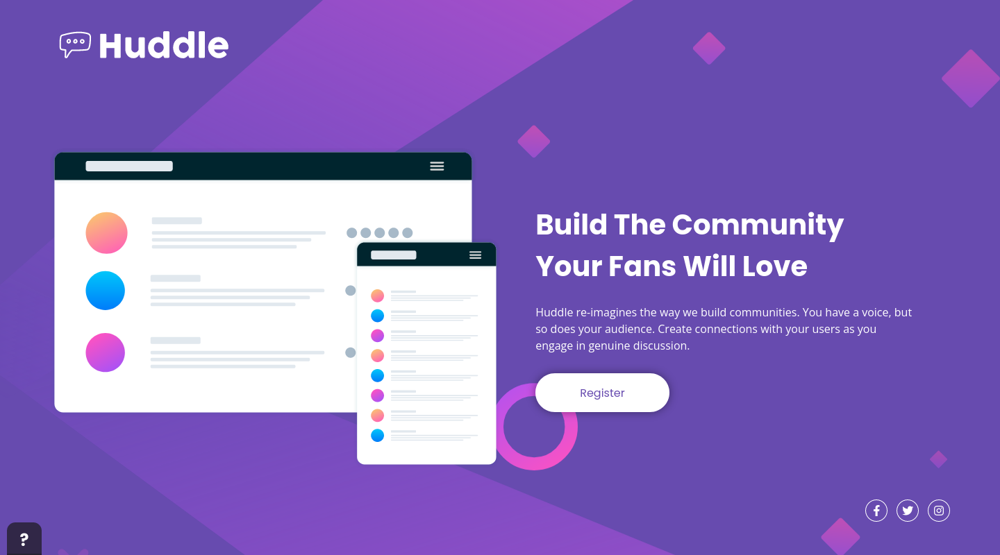

# Frontend Mentor - Huddle landing page with single introductory section solution

This is a solution to the [Huddle landing page with single introductory section challenge on Frontend Mentor](https://www.frontendmentor.io/challenges/huddle-landing-page-with-a-single-introductory-section-B_2Wvxgi0). Frontend Mentor challenges help you improve your coding skills by building realistic projects. 

## Table of contents

- [Frontend Mentor - Huddle landing page with single introductory section solution](#frontend-mentor---huddle-landing-page-with-single-introductory-section-solution)
  - [Table of contents](#table-of-contents)
  - [Overview](#overview)
    - [The challenge](#the-challenge)
    - [Screenshot](#screenshot)
    - [Links](#links)
  - [My process](#my-process)
    - [Built with](#built-with)
    - [What I learned](#what-i-learned)
    - [Continued development](#continued-development)
  - [Author](#author)

## Overview

### The challenge

Users should be able to:

- View the optimal layout for the page depending on their device's screen size
- See hover states for all interactive elements on the page

### Screenshot

### Links

<!-- TODO: Solution URL -->
<!-- - Solution URL: [Add solution URL here](https://your-solution-url.com) -->
- Live Site URL: [GitHub Pages](https://lau-san.github.io/fm-huddle-landing-page/)

## My process

### Built with

- Semantic HTML5 markup
- Flexbox
- CSS Grid
- [Sass](https://sass-lang.com)

### What I learned

I got practice positioning elements with `position:absolute` and `position:fixed` (with the attribution)

### Continued development

Backgrounds are still hard for me, so I need to focus more on that.

## Author

- Frontend Mentor - [@Lau-San](https://www.frontendmentor.io/profile/Lau-San)